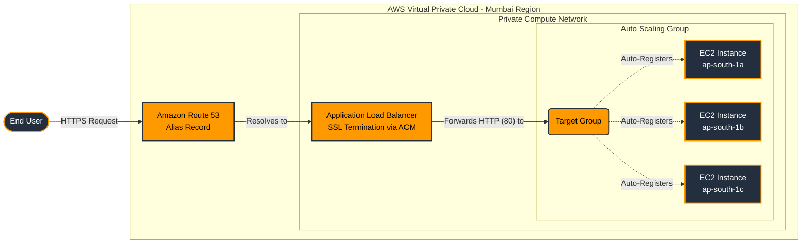
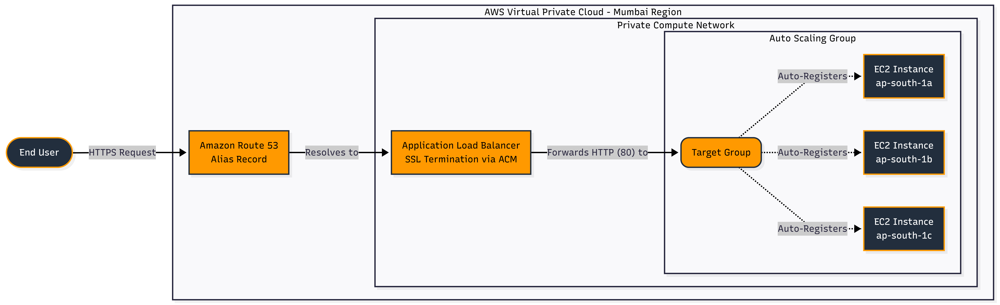

# Dynamic Compute: Load Balanced Architecture

## Objective

The objective of this architecture is to deploy a highly available, fault-tolerant, and secure web application on AWS that can maintain baseline capacity, recover from unhealthy compute nodes, and scale across multiple Availability Zones. The design places an EC2 Auto Scaling Group behind an internet-facing Application Load Balancer, enforces HTTPS access with AWS Certificate Manager, and protects the origin EC2 instances by allowing inbound application traffic only from the load balancer.

## Services Used

| AWS Service | Role in the Architecture |
| --- | --- |
| Amazon Route 53 | Hosts DNS records for the custom domain and routes `awswithme.shop` and `www.awswithme.shop` to the Application Load Balancer using Alias A records. |
| AWS Certificate Manager (ACM) | Provisions and manages the public SSL/TLS certificate used by the ALB HTTPS listener. DNS validation is performed through Route 53. |
| Elastic Load Balancing - Application Load Balancer (ALB) | Acts as the public entry point, terminates HTTPS traffic on port 443, redirects HTTP traffic on port 80 to HTTPS, and distributes requests to healthy EC2 instances. |
| Target Group | Groups the backend EC2 instances and allows the ALB to route HTTP traffic to registered healthy targets. |
| Amazon EC2 | Runs the Nginx web server and deployed application files using instances launched from a custom web server AMI. |
| Amazon Machine Image (AMI) | Captures the configured web server baseline, allowing the Auto Scaling Group to launch consistent replacement instances. |
| EC2 Launch Template | Defines the instance configuration used by the Auto Scaling Group, including the custom AMI and EC2 security group. |
| Amazon EC2 Auto Scaling | Maintains the desired compute capacity across multiple Availability Zones and replaces unhealthy instances automatically. |
| Security Groups | Enforce network access boundaries: the ALB accepts public HTTP/HTTPS traffic, while EC2 instances accept HTTP only from the ALB security group. |
| Amazon VPC, Subnets, and Availability Zones | Provide the network foundation for deploying the ALB and EC2 instances across multiple Availability Zones in the Mumbai region (`ap-south-1`). |

## Architecture Flow

<!-- Cntrl+click asg_lb.png -->

### How the System Works

1. A user accesses the application through the custom domain `awswithme.shop` or `www.awswithme.shop`.
2. Amazon Route 53 resolves the domain using Alias A records that point directly to the internet-facing Application Load Balancer.
3. The ALB receives public traffic. Requests on port 80 are permanently redirected to HTTPS on port 443 using a `301` redirect.
4. The HTTPS listener uses an ACM-managed public certificate to terminate TLS at the load balancer.
5. After TLS termination, the ALB forwards traffic to the `SPA-Target-Group` over HTTP port 80.
6. The Auto Scaling Group launches and manages EC2 instances from the `SPA-Scaling-Template`, which uses the `SPA-Webserver-AMI`.
7. EC2 instances run the Nginx-hosted application and are distributed across multiple Availability Zones for resilience.
8. Elastic Load Balancing health checks detect unhealthy instances. The Auto Scaling Group replaces unhealthy capacity automatically to preserve availability.
9. EC2 instances are not directly exposed to the public internet for application traffic. Their security group allows inbound HTTP only from the ALB security group.

## Cost Analysis

This architecture is designed to be Free Tier-aware by using small EC2 instance types, managed certificates, and AWS-native load balancing. However, the final monthly cost depends on account age, selected AWS Free Tier plan, region, and runtime duration.

- EC2 uses `t3.micro`, which is Free Tier eligible in supported regions and account conditions. Running three instances continuously can exceed the common 750 instance-hour monthly allowance because usage is aggregated across instances.
- The Auto Scaling Group baseline of `Min: 2`, `Desired: 3`, and `Max: 5` is appropriate for high availability, but the environment should be stopped, scaled down, or run only during lab windows if the goal is to minimize cost.
- ACM public certificates used with integrated AWS services such as ALB are available at no additional charge.
- Application Load Balancer usage may be covered by Free Tier credits or service-specific allowances, but ALB hours and Load Balancer Capacity Units can generate charges after those allowances.
- Route 53 Alias records to AWS resources are cost-efficient, but hosted zones and domain registration are generally billable and should be budgeted separately.

For a strict learning-lab setup, keep the architecture active only while testing, monitor the AWS Billing console, configure AWS Budgets, and delete or scale down the ALB, ASG, Route 53 hosted zone, and unused AMIs/snapshots when the lab is complete.

## Key Engineering Decisions - The Why

### High Availability and Fault Tolerance

The compute layer is distributed across multiple Availability Zones in the Mumbai region through an Auto Scaling Group. This protects the application from isolated data center failures and allows the load balancer to continue routing traffic to healthy instances in available zones. The internet-facing ALB dynamically distributes incoming requests across registered targets.

### Security by Design

The ALB enforces secure client access by terminating HTTPS traffic with an ACM-managed SSL/TLS certificate. Standard HTTP traffic on port 80 is redirected to HTTPS on port 443 using a `301` permanent redirect. The backend EC2 instances remain protected by a restrictive security group that accepts application traffic only from the ALB security group.

Note: In this implementation, TLS is terminated at the ALB and traffic from the ALB to EC2 uses HTTP port 80 within the VPC. If full TLS encryption from client to instance is required, the target group can be changed to HTTPS and certificates can be configured on the backend instances.

### Self-Healing Compute Layer

The Auto Scaling Group maintains a fixed baseline capacity with `Minimum: 2`, `Desired: 3`, and `Maximum: 5` instances. By enabling Elastic Load Balancing health checks, unhealthy instances are detected, removed, and replaced automatically. This keeps the application available without requiring manual intervention during instance failure.

## Reference Configuration

| Component | Configuration |
| --- | --- |
| Region | Mumbai, `ap-south-1` |
| Domain | `awswithme.shop`, `www.awswithme.shop` |
| ACM Certificate | Public certificate, DNS validated, RSA 2048 |
| ALB | `SPA-Secure-ALB`, internet-facing, IPv4 |
| Target Group | `SPA-Target-Group`, instance targets, HTTP port 80 |
| Launch Template | `SPA-Scaling-Template` |
| Custom AMI | `SPA-Webserver-AMI` |
| Auto Scaling Group | `SPA-ASG` |
| ASG Capacity | Minimum 2, Desired 3, Maximum 5 |
| Web Server | Nginx on Amazon Linux 2023 |